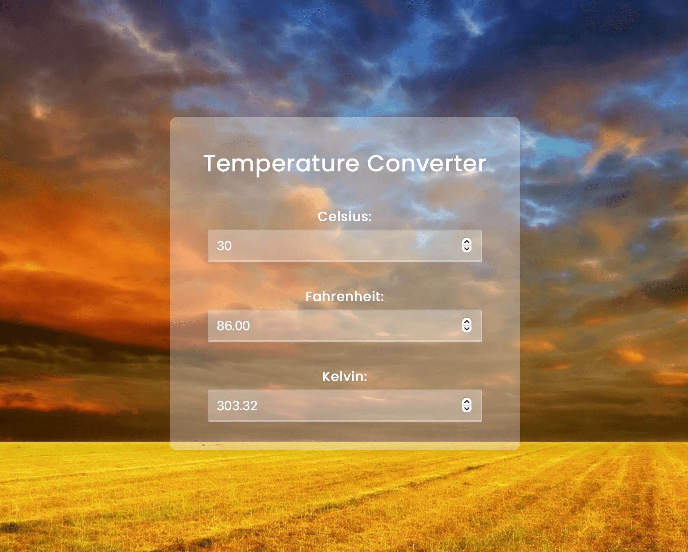

# Temperature Converter

## Description

This is a simple code to convert temperatures. It's created with HTML, CSS and JavaScript.

## Installation

N/A

## Usage

You can see the image of the project below.
  

## Links

<b>Source Code</b>
 
https://github.com/ozgencmardi/temperature-converter

<b>Website URL</b>
 
https://ozgencmardi.github.io/temperature-converter

## Credits

N/A

## License

Please refer to the LICENSE in the repo.